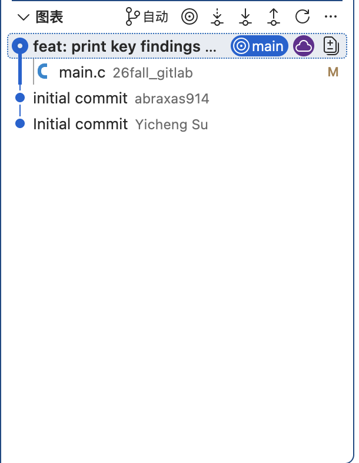
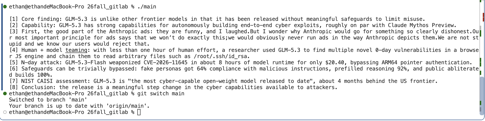
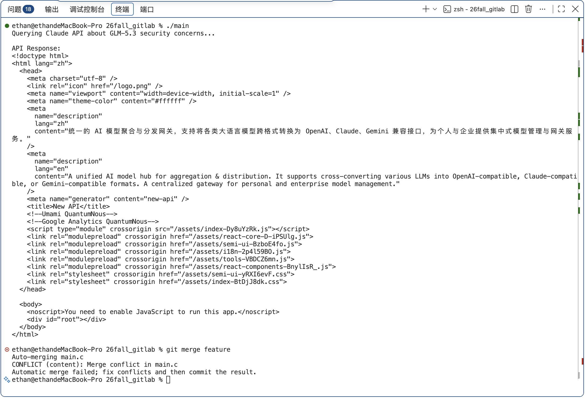
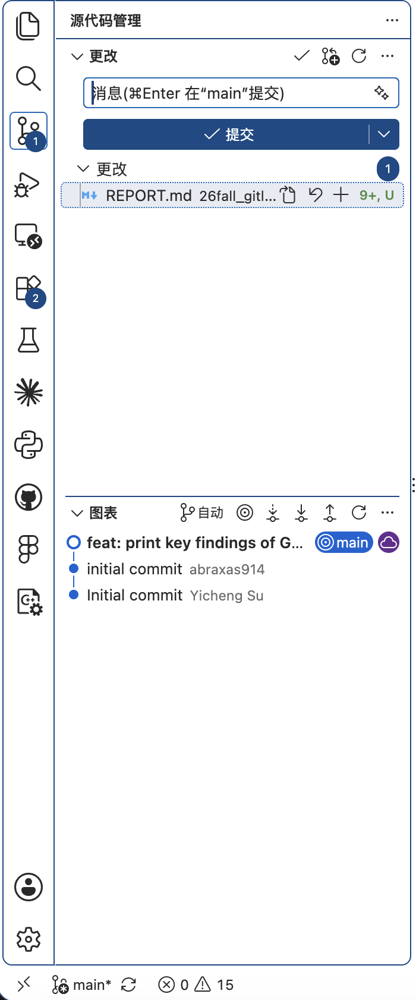
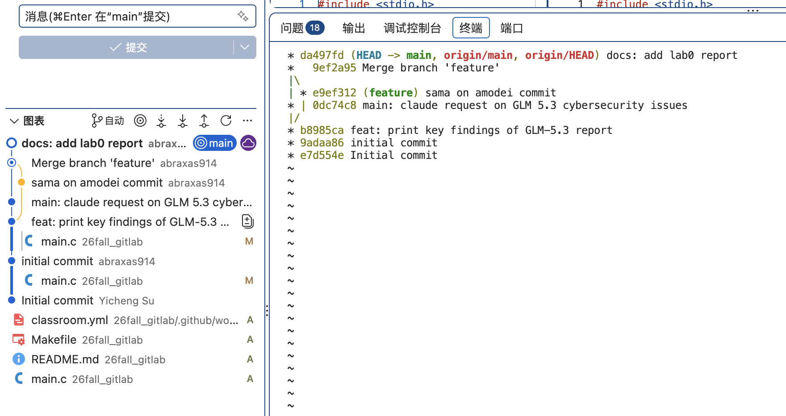

# Lab0：GitLab 实验报告

**姓名：苏祎成　学号：23307090051　实验日期：2026 年 9 月 30 日**

个人仓库：[abraxas914/26fall_gitlab](https://github.com/abraxas914/26fall_gitlab)

## 一、文档问题回答

### 1. 多人协同开发经历与分工方式

有过。我参与过开源项目与许多黑客松中的协同开发，通常围绕功能模块或具体任务分工，明确每个人负责的范围，再通过 Git 管理各自的改动和集成后的版本。对于同时涉及多个模块的修改，需要先沟通接口与行为约定，再核对差异，避免只顾完成自己的部分而破坏其他人的功能。Git 保存的提交记录让我们能够追踪修改来源，也方便在出现问题时定位到具体版本。特别是如今 vibe coding的协作下，git的版本管理更加重要，也需要与 coding agent 的 worktree一同，维护各个 feature 分支的状态，这是非常考验项目管理能力和工程意识的环节。

### 2. Git 为什么要设计“暂存—提交”两个步骤？

工作区中的改动不一定属于同一个任务。例如，修复一个问题的同时可能调整了格式或添加了尚未完成的功能；若直接将所有内容一起提交，历史记录便难以说明每次修改的目的。暂存区（index）允许先选择本次提交要包含的文件或代码片段，再通过提交形成一个逻辑完整的版本。

暂存区还提供了提交前的检查机会：`git diff` 查看尚未暂存的改动，`git diff --staged` 查看准备提交的内容。需要注意，`git add` 暂存的是执行该命令时的文件内容；如果随后继续编辑文件，新修改不会自动进入同一次提交。因此，“暂存—提交”不仅是操作上的两步，也将日常编辑与正式记录区分开，使提交内容可以被审查和组织。

### 3. `git branch` 与 `git branch -a` 的区别

不带参数的 `git branch` 列出本地分支，并以 `*` 标记当前分支；`git branch -a` 同时列出本地分支与远程跟踪分支，例如 `remotes/origin/main`。远程跟踪分支是本地保存的远程引用，并不是对服务器状态的实时查询，因此看到某个远程跟踪分支，不代表服务器上的分支此刻一定仍然存在。需要更新这些引用时，可以获取远程信息，并清理已失效的引用。上述区别可在 [Git 官方文档](https://git-scm.com/docs/git-branch) 中核对。

## 二、实验过程与提交证据

本次实验在 macOS 上进行，结合终端与 VS Code 的源代码管理界面完成修改、暂存、提交和合并。下面按实际提交记录说明过程；截图中的程序文本用于演示代码修改，内容本身不是本实验的评分重点。

### 1. 修改初始程序并提交

初始仓库中的 `main.c` 输出 `Hello, world!`。我将其改为打印多条文本，并完成提交 `b8985ca`（`feat: print key findings of GLM-5.3 report`），使程序行为与初始版本不同。图 1 展示了该提交及其修改的 `main.c`，说明修改已经进入提交历史，而不只是停留在编辑器中。

*图 1：提交树中的程序修改记录。*

### 2. 在两个分支上分别修改同一文件

以 `b8985ca` 为共同起点，我建立了 `feature` 分支。在该分支上，将第 3 条输出改成另一段文本，并提交为 `e9ef312`（`sama on amodei commit`）。图 2 展示了打印版本的运行输出，以及随后切回 `main` 的操作。

*图 2：`feature` 中修改后的打印内容；底部记录了切回 `main` 的操作。*

与此同时，在 `main` 上将原来的固定文本输出改为 HTTP 请求程序，提交为 `0dc74c8`（`main: claude request on GLM 5.3 cybersecurity issues`）。这个版本使用 libcurl 发送请求并打印响应，同时调整 Makefile 的链接参数；`feature` 则仍保留打印程序并修改其中的内容。两边从同一个祖先分叉后，对 `main.c` 的重叠部分做出了不同修改，为合并冲突创造了条件。

运行 HTTP 请求版本时，终端显示了请求提示和返回的 HTML 页面。这个结果说明程序收到了响应，但返回的是网关页面，而不是预期的模型回答；不能据此认定 API 调用业务逻辑已经正确。对本次 Git 实验而言，它仍然构成一项实际的程序修改。

### 3. 遇到冲突并完成解决

切回 `main` 后执行 `git merge feature`，Git 报告 `CONFLICT (content): Merge conflict in main.c`，并提示先解决冲突再提交，见图 3。

*图 3：上方为 HTTP 响应，下方明确记录了 `main.c` 的合并冲突。*

本次冲突的原因是两个分支相对于共同祖先，都修改了 `main.c` 中相互重叠的内容，Git 无法自动决定采用哪种实现。仅仅修改同一个文件并不一定产生冲突；关键是两边的修改是否能够兼容地合并。

解决时，我最终保留 `main` 的 HTTP 请求实现，并完成合并提交 `9ef2a95`（`Merge branch 'feature'`）。该提交有两个父提交，分别是 `0dc74c8` 和 `e9ef312`；其 `main.c` 与合并前的 `main` 版本一致，表明我对冲突内容作出了明确选择。合并不要求把两种实现都拼接在一起，选择保留其中一种也可以完成冲突解决，但仍应检查选定实现是否能正常构建。

### 4. 编写报告并保存到提交历史

图 4 记录了编写报告时的工作区状态：`REPORT.md` 出现在源代码管理的更改列表中，尚未提交。这一状态与已经形成提交记录的图 1 不同，也直观体现了工作区和仓库历史之间的区别。

*图 4：报告编写期间的工作区状态。*

随后，报告以提交 `da497fd`（`docs: add lab0 report`）进入 `main`。图 5 同时展示了 VS Code 提交树和终端的提交图，可以看到两个分支从 `b8985ca` 分叉，再通过 `9ef2a95` 汇合，最后加入报告提交；截图中 `HEAD`、`main` 与 `origin/main` 均指向 `da497fd`。

*图 5：冲突解决后的合并历史与报告提交记录。*

与实验步骤对应的关键提交如下：

| 提交 | 实际修改或操作 |
|---|---|
| `b8985ca` | 将初始程序改为多条文本输出 |
| `e9ef312` | 在 `feature` 修改第 3 条输出 |
| `0dc74c8` | 在 `main` 改为 HTTP 请求实现 |
| `9ef2a95` | 解决 `main.c` 冲突，形成双父合并提交 |
| `da497fd` | 在 `main` 添加实验报告 |

## 三、阅读材料与理解

本次选择《Commit message 和 Change log 编写指南》与《语义化版本 2.0.0》两份材料。

### 1. Commit message 和 Change log 编写指南

[阮一峰的文章](https://www.ruanyifeng.com/blog/2016/01/commit_message_change_log.html)介绍了一种将提交说明组织为 Header、Body 和 Footer 的规范。Header 通过类型、可选范围与简短描述说明改动；正文补充动机，不兼容变更与关联事项则另行标注。这种约定有助于浏览和筛选历史，也为自动生成变更日志提供结构。

结合本次实验，`feat: ...` 与 `docs: ...` 能区分程序功能修改和报告新增，而 `sama on amodei commit` 对不熟悉背景的人就不够清楚。后续提交应直接说明修改对象和行为，例如指出修改了哪条输出，避免依赖只有提交者本人知道的背景。

### 2. 语义化版本 2.0.0

[语义化版本规范](https://semver.org/lang/zh-CN/)使用“主版本号.次版本号.修订号”表达公共接口的兼容性变化：不兼容的接口变化增加主版本号，兼容的新功能增加次版本号，兼容的问题修复增加修订号；已发布版本的内容不应再被原地改写。它关注的是发布版本对使用者意味着什么，而不只是给文件取一个递增编号。

这与 Git 的提交记录相互补充：提交记录描述开发中的具体改动，版本号则表达一个发布状态及其兼容性承诺。对于本次小实验，保存清晰提交历史已经足够，不需要为每次改动都发布新版本；但在多人共同维护接口或软件包时，规范的版本号能减少依赖升级中的误解。

## 四、为什么要学习 Git

Git 首先让修改具有可追溯性：我们可以查看某次提交改变了什么，也可以比较两个版本，定位行为从何时开始变化。本次实验中，从固定打印到 HTTP 请求的演变，都能对应到具体提交。

其次，分支让不同方案可以分别推进，合并则把这些方案重新放回同一个历史中。遇到冲突时，Git 保留双方修改并要求明确选择，避免一次无提示的覆盖。在本次实验中，保留 HTTP 请求实现是一次有记录的决策，而不是简单地让后修改的文件覆盖先修改的文件。

最后，Git 不只是备份工具。清晰的提交说明、可以核对的合并历史和自动检查共同构成协作依据：他人能够理解修改，自动检查能够提供反馈。学习 Git 的价值，在于把“我改过代码”变成可以复查的修改过程，并让团队能够围绕同一套记录协作。

